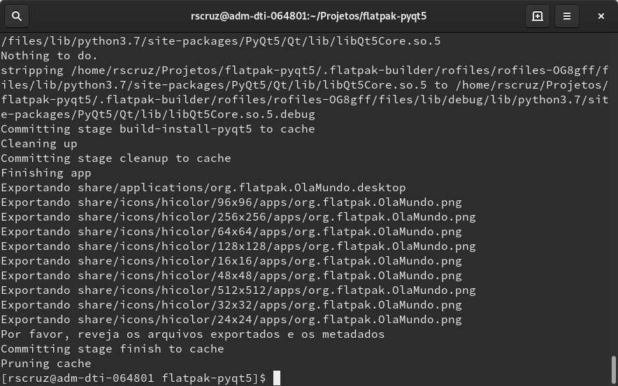
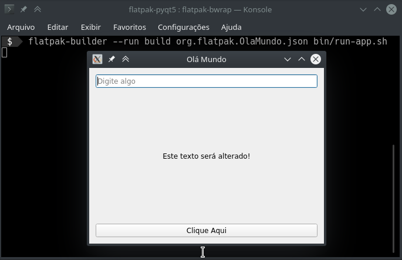
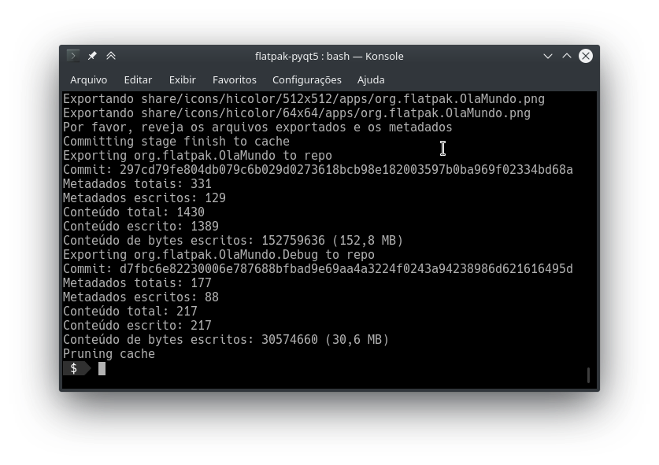
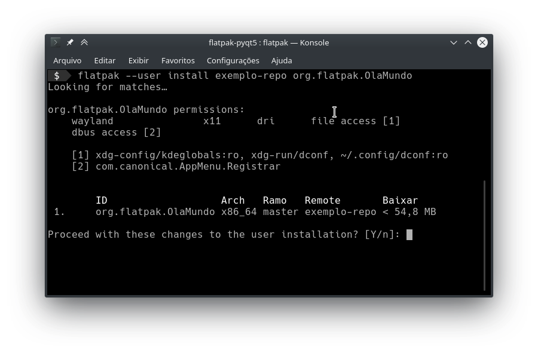
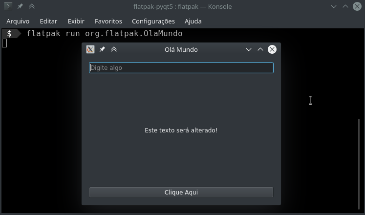
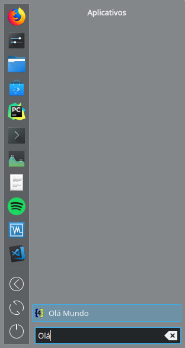
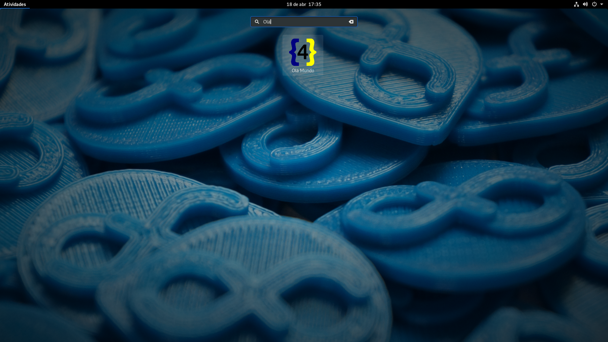
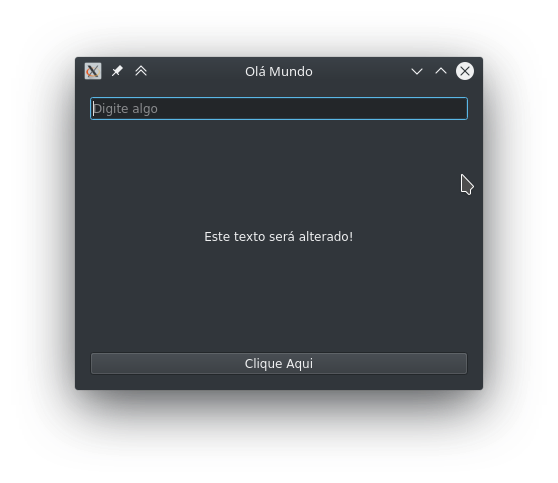
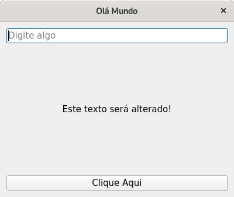
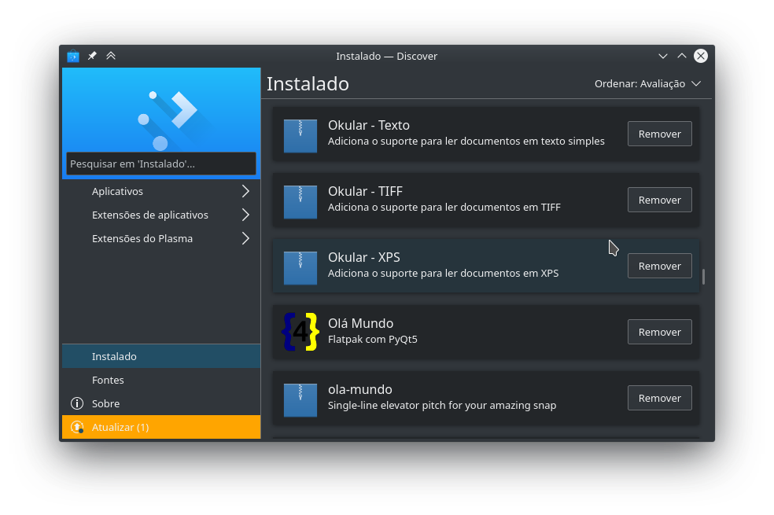

Terceira parte dos posts sobre construção de aplicativos com Python e Qt 5 (PyQt5), se você está começando por este texto recomendo a leitura dos links a baixo:

---

https://plus.diolinux.com.br/t/tutorial-python-e-qt-5-parte-1/1905?u=natorsc

https://plus.diolinux.com.br/t/tutorial-python-e-qt-5-parte-2/1981?u=natorsc

---

Nesta terceira parte vamos ver como realizar o empacotamento e vamos utilizar o formato **Flatpak**, a escolha deste formato é para que seja mantida a proposta original que era gerar um aplicativo de forma similar ao que temos no Gnome Builder:

---

https://plus.diolinux.com.br/t/tutorial-python-gtk-3-e-flatpak/948?u=natorsc

---

Outro motivo para este texto está no fato da documentação não exibir um exemplo amplo da utilização do Flatpak no empacotamento de aplicativos Python e os poucos exemplos que encontrei abrangem somente pequenos scripts sem grandes dependências.

> **OBS**: Os códigos exibidos aqui foram testados no **Fedora 30** e no **KDE Neon (18.04)**.

Para este exemplo está sendo utilizada a seguinte estrutura de diretórios e arquivos:

```bash
flatpak-pyqt5
├── bin
│   └── run-app.sh
├── desktop-entry
│   └── org.flatpak.OlaMundo.desktop
├── LICENSE
├── ola-mundo
│   ├── forms
│   │   ├── mainwindow-creator.ui
│   │   └── mainwindow-designer.ui
│   ├── icons
│   │   ├── icon.ico
│   │   └── icon.png
│   └── MainWindow.py
├── org.flatpak.OlaMundo.json
├── Pipfile
├── Pipfile.lock
└── README.md
```

Onde:

`run-app.sh`, este será o arquivo responsável por executar o aplicativo. Fiz na forma de um script por ser mais simples do que transformar a pasta `ola-mundo` em um pacote do Python (`setup.py`). Criar um pacote do Python não é complexo, contudo acredito que este não é o foco neste momento.

O arquivo `run-app.sh` tem o seguinte código:

```bash
#!/bin/sh
cd /app/ola-mundo
python3 MainWindow.py
```

`org.flatpak.OlaMundo.desktop`, arquivo que gera o desktop entry (atalho) que executa o programa, seu conteúdo é:

```txt
#!/usr/bin/env xdg-open
[Desktop Entry]
Name=Olá Mundo
GenericName=Flatpak com PyQt5
Comment=Flatpak com PyQt5
Type=Application
Exec=run-app.sh
Icon=org.flatpak.OlaMundo
Terminal=false
Categories=Development;Qt;
StartupNotify=true
```

`org.flatpak.OlaMundo.json`, falaremos desse arquivo mais a frente.

Os demais arquivos foram gerados na parte 2.

> **OBS**: Todo o código contido neste texto estará disponível no Github.

## Instalando o Flatpak

O Fedora no geral já vem com suporte ao Flatpak, então só existe a necessidade de se configurar o **repositório** do Flatpak (lembre-se de reiniciar após configurar o repositório) e de realizar a instalação do `flatpak-builder`:

```bash
sudo dnf install flatpak-builder
```

No ubuntu o site oficial recomenda a instalação via **PPA**:

Adicionando o PPA:

```bash
sudo add-apt-repository ppa:alexlarsson/flatpak
```

Atualizando a lista de repositórios (isso se o comando a cima não realizar esse procedimento de forma automática):

```bash
sudo apt update
```

Instalando o Flatpak:

```bash
sudo apt install flatpak
```

Opcionalmente pode-se instalar o suporte a Flatpaks no Gnome Software:

```bash
sudo apt install gnome-software-plugin-flatpak
```

Adicionando o repositório **Flathub** ao Flatpak:

```bash
flatpak remote-add --if-not-exists flathub https://flathub.org/repo/flathub.flatpakrepo
```

Reiniciando o sistema:

```bash
sudo reboot
```

Por fim instalando o **flatpak-builder** que é a ferramenta que irá permitir a construção do formato Flatpak:

```bash
sudo apt install flatpak-builder
```

Caso esteja em outras distribuições Linux basta visitar a [página oficial de configuração do Flatpak](https://flatpak.org/setup/).

## Instalando o Runtime

O runtime é o ambiente (sandbox) onde o aplicativo será executado, até o presente momento o Flatpak possui os seguintes runtimes:

- **Freedesktop**: Este é o runtime padrão (base), nele temos D-Bus, GLib, Gtk3, PulseAudio, X11 e Wayland. Interessante notar que ele serve de base para os runtimes GNOME e KDE.
- **GNOME**: Runtime baseado no Freedesktop e são realizadas configurações especificas para o ambiente Gnome como, Clutter, Gjs, ,GObject Introspection, GStreamer, GVFS, Libnotify, Libsecret, LibSoup, PyGObject, Vala e WebKitGTK.
- **KDE**: Runtime baseado no Freedesktop e é adicionado o Qt e os frameworks do KDE.

Neste texto será utilizado o runtime do **KDE** porque nosso aplicativo é baseado em Qt, contudo pode-se utilizar também o Freedesktop, fiz um teste e a execução do aplicativo foi normal.

Para instalar o runtime KDE 5.12:

```bash
flatpak install org.kde.Platform//5.12 org.kde.Sdk//5.12
```

Caso queira escolher a versão que será instalada:

```bash
flatpak install org.kde.Platform org.kde.Sdk
```

Para instalar o runtime Freedesktop 18.08:

```bash
flatpak install flathub org.freedesktop.Platform//18.08 org.freedesktop.Sdk//18.08
```

Caso queira escolher a versão que será instalada:

```bash
flatpak install flathub org.freedesktop.Platform org.freedesktop.Sdk
```

## Criando o manifest

Manifest é um arquivo do tipo `Json` ou `YAML` onde iremos descrever os passos necessários para a construção do aplicativo.

Em seu nome é comum utilizar um identificador com 3 seguimentos que irão gerar o **application ID** (ID do aplicativo), de forma grosseira podemos dizer que o nome é composto por:

```bash
Dominio.EmpresaOganização.NomeDoApp.json
```

Para o exemplo utilizei `org.flatpak.OlaMundo.json` como nome do arquivo manifest.

Neste arquivo dei preferencia por criar vários pequenos passos ao invés de criar uma sessão com vário comandos seguidos.

No final do arquivo irei comentar as principais opções, isso porque o formato json não aceita comentários no código.

```json
{
  "app-id": "org.flatpak.OlaMundo",
  "runtime": "org.kde.Platform",
  "runtime-version": "5.12",
  "sdk": "org.kde.Sdk",
  "command": "run-app.sh",
  "finish-args": [
    "--socket=wayland",
    "--socket=x11",
    "--device=dri"
  ],
  "modules": [
    {
      "name": "run-app",
      "buildsystem": "simple",
      "build-commands": [
        "install -D run-app.sh /app/bin/run-app.sh"
      ],
      "sources": [
        {
          "type": "file",
          "path": "bin/run-app.sh"
        }
      ]
    },
    {
      "name": "copy-icons",
      "buildsystem": "simple",
      "build-commands": [
        "install -Dm0644 icon.png /app/share/icons/hicolor/16x16/apps/org.flatpak.OlaMundo.png",
        "install -Dm0644 icon.png /app/share/icons/hicolor/24x24/apps/org.flatpak.OlaMundo.png",
        "install -Dm0644 icon.png /app/share/icons/hicolor/32x32/apps/org.flatpak.OlaMundo.png",
        "install -Dm0644 icon.png /app/share/icons/hicolor/48x48/apps/org.flatpak.OlaMundo.png",
        "install -Dm0644 icon.png /app/share/icons/hicolor/64x64/apps/org.flatpak.OlaMundo.png",
        "install -Dm0644 icon.png /app/share/icons/hicolor/96x96/apps/org.flatpak.OlaMundo.png",
        "install -Dm0644 icon.png /app/share/icons/hicolor/128x128/apps/org.flatpak.OlaMundo.png",
        "install -Dm0644 icon.png /app/share/icons/hicolor/256x256/apps/org.flatpak.OlaMundo.png",
        "install -Dm0644 icon.png /app/share/icons/hicolor/512x512/apps/org.flatpak.OlaMundo.png"
      ],
      "sources": [
        {
          "type": "file",
          "path": "ola-mundo/icons/icon.png"
        }
      ]
    },
    {
      "name": "desktop-entry",
      "buildsystem": "simple",
      "build-commands": [
        "install -D org.flatpak.OlaMundo.desktop /app/share/applications/org.flatpak.OlaMundo.desktop"
      ],
      "sources": [
        {
          "type": "file",
          "path": "desktop-entry/org.flatpak.OlaMundo.desktop"
        }
      ]
    },
    {
      "name": "copy-app",
      "buildsystem": "simple",
      "build-commands": [
        "cp -r ola-mundo/ /app/ola-mundo/"
      ],
      "sources": [
        {
          "type": "dir",
          "path": "ola-mundo/",
          "dest": "ola-mundo/"
        }
      ]
    },
    {
      "name": "install-pyqt5-sip",
      "buildsystem": "simple",
      "build-commands": [
        "pip3 install --prefix=/app --no-deps PyQt5_sip-4.19.15-cp37-cp37m-manylinux1_x86_64.whl"
      ],
      "sources": [
        {
          "type": "file",
          "url": "https://files.pythonhosted.org/packages/2e/ee/c6efd28dcb65e990411be50a46c9757f12202df94cfee73689223bbc2cf0/PyQt5_sip-4.19.15-cp37-cp37m-manylinux1_x86_64.whl",
          "sha256": "31a59f76168df007b480b9382256c20f8898c642e1394df2990559f0f6389f66"
        }
      ]
    },
    {
      "name": "install-pyqt5",
      "buildsystem": "simple",
      "build-commands": [
        "pip3 install --prefix=/app --no-deps PyQt5-5.12.1-5.12.2-cp35.cp36.cp37.cp38-abi3-manylinux1_x86_64.whl"
      ],
      "sources": [
        {
          "type": "file",
          "url": "https://files.pythonhosted.org/packages/98/61/fcd53201a23dd94a1264c29095821fdd55c58b4cd388dc7115e5288866db/PyQt5-5.12.1-5.12.2-cp35.cp36.cp37.cp38-abi3-manylinux1_x86_64.whl",
          "sha256": "d4e88208dfd017636e4b1f407990d0c3b6cf47afed6be4f2fb6ca887ef513e4b"
        }
      ]
    }
  ]
}
```

Onde:

- **app-id**:Identificador único do aplicativo (composto por três partes).
- **runtime**: Este é o ambiente que será utilizado como base para a execução do aplicativo.
- **runtime-version**: Versão do runtime que se deseja utilizar.
- **sdk**: Nome do SDK (Software development kit - Kit de desenvolvimento de software) que será utilizando juntamente com o runtime.
- **command**: Este é o ponto de entrada do aplicativo, basicamente o comando que executa o aplicativo.
- **finish-args**: Por padrão a sandbox isola o aplicativo e para termos acessos externos precisamos listar as permissões. No caso queremos acesso ao `X11/Wayland` para exibir a janela do aplicativo e ao `device=dri` para termos acesso a renderização OpenGL. Por exemplo se o aplicativo precisa de acesso a internet é necessário adicionar `--share=network`.
- **modules**: Aqui são listadas todas as dependências e arquivos necessário para a execução do aplicativo. Cada novo modulo que criamos é composto por:
    - **name**: Um nome que especifica a operação que será realizada.
    - **buildsystem**: Maneira com que iremos construir a dependência ou arquivo em questão.
    - **build-commands**: Lista de comandos que serão executados.
    - **sources**: Lista onde passamos o tipo de arquivos que estamos manipulando.
      - **type**: Tipo de objeto que estamos manipulando (file, archive, dir, git, etc).

No geral utilizei o `buildsystem` como `simple`, isso permite que seja especificado o comando. Os principais parâmetros que foram utilizados nos comandos foram:

- **-D**: O que permitiu especificar a origem e o destino dos arquivos.
- **-m**: O que permitiu alterar a metadata do arquivo. No caso o nome do arquivo e sua permissão.

> **OBS**: `/app` sempre faz referencia a pasta principal (raiz) do aplicativo.

> `/app/share/applications/` é o caminho recomendado para arquivos `*.desktop` na documentação.

> `/app/share/icons/hicolor/SIZExSIZE/apps/` é o caminho recomendo para arquivos de ícone na documentação. A variedade de tamanhos se deve ao fato de que os ícones do sistema tem apresentação em tamanhos variados e a ausência de um tamanho irá gerar a perda do ícone.

Esses foram os principais parâmetros utilizados e a documentação do Flatpak apresenta diversas outras opções para atender as mais variadas necessidades.

## Comandos

Hora de vermos os comandos necessário para a criação do aplicativo, criação do repositório e instalação do aplicativo.

Na primeira vez que o aplicativo é construído utilizamos o comando:

```bash
flatpak-builder build org.flatpak.OlaMundo.json
```

Onde:

- **flatpak-builder**: Ferramenta que realiza a construção do aplicativo.
- **build**: Nome da pasta onde o aplicativo será criado. Se a pasta não existir a mesma será criada. Eu escolhi o nome `build` por se tratar de nome comumente utilizado no desenvolvimento com Python, esse nome também está na maior parte dos templetes de `.gitignore` para Python.
- **org.flatpak.OlaMundo.json**: Arquivo manifest do aplicativo.

Nas próximas vezes em que o aplicativo for construído deve-se utilizar:

```bash
flatpak-builder build org.flatpak.OlaMundo.json --force-clean
```

Isso porque o parâmetro `--force-clean` irá limpar o conteúdo da pasta `build`.

> **OBS**: Sempre verifique o **log** do comando, visto que ele exibe possíveis erros ou mesmo alertas!



Para testar a execução do aplicativo utiliza-se o comando:

```bash
flatpak-builder --run build org.flatpak.OlaMundo.json bin/run-app.sh
```



- `bin/run-app.sh`, Caminho até o script que criamos no inicio deste texto.

Aplicativo testado agora vamos criar o repositório, para isso:

```bash
flatpak-builder --repo=dist --force-clean build org.flatpak.OlaMundo.json
```



> **OBS**: Uma pasta `dist` será criada caso a mesma não exista. Essa pasta **não** representa o nome do repositório, uma vez que esse nome é definido no comento em que **adicionamos** o repositório.

> Está sendo utilizado o nome `dist` por se tratar de um nome de pasta comum no desenvolvimento com Python.

Agora vamos adicionar o repositório criado ao Flatpak, por questão de curiosidade você pode executar `flatpak remotes` para ver os repositórios que estão disponíveis antes da operação.

Para adicionar o repositório:

```bash
flatpak --user remote-add --no-gpg-verify exemplo-repo dist
```

Onde:

- **--user**: Repositório estará disponível apenas para o usuário atual. 
- **remote-add**: Definindo que desejamos adicionar um novo repositório.
- **--no-gpg-verify**: Não verificar a chave GPG.
- **exemplo-repo**: Nome que é exibido quando executamos o comando `flatpak remotes`.
- **dist**: Pasta/Repositório que foi criado no comando: `flatpak-builder --repo=dist --force-clean build org.flatpak.OlaMundo.json`.

Com o repositório adicionado pode ser executado novamente `flatpak remotes` para ver o resultado.

Se for listado o repositório `exemplo-repo` podemos realizar a instalação do aplicativo com o comando:

```bash
flatpak --user install exemplo-repo org.flatpak.OlaMundo
```



Com o final da instalação podemos executar o aplicativo com o comando:

```bash
flatpak run org.flatpak.OlaMundo
```



Interessante notar que como criamos o arquivo `org.flatpak.OlaMundo.desktop` o aplicativo também está disponível no menu iniciar da distribuição:

**KDE Neon**



**Fedora 30**



E claro ao executar o aplicativo pelo menu o mesmo deve funcionar sem problemas.

**KDE Neon**



**Fedora**



---

Para remover o aplicativo podemos utilizar o comando:

```bash
flatpak remove org.flatpak.OlaMundo
```

Ou até mesmo procurar por ele na loja de aplicativos:



Para remover o repositório utilize o comando:

```bash
flatpak remote-delete exemplo-repo
```

Para verificar se o repositório foi realmente removido: `flatpak remotes`.

Pronto temos nosso aplicativo criado com PyQt5 empacotado utilizando Flatpak!

## Extra

O Flatpak fornece um script Python chamado [`flatpak-pip-generator`](https://github.com/flatpak/flatpak-builder-tools/tree/master/pip) que auxilia na criação de dependências de um determinado pacote.


Para sua utilização basta executar no terminal:

```bash
python3 flatpak-pip-generator NomeDoPacote
```

Um exemplo seria:

```bash
python3 flatpak-pip-generator request
```

O resultado gerado pelo comando a cima é um arquivo `*.json` e seu conteudo pode ser utilizando no parametro `modules: []` do arquivo manist.

> **OBS**: Não são todos os pacotes/bibliotecas do Python que são compatíveis.

# Conclusão

Se você programa em Python já deve ter notado que em muitos casos temos um aplicativo pronto que não sabemos como distribuir.

Seja pela dificuldade de se gerar os binários ou pela dificuldade de se criar um instalador para os binarios que foram criados.

Neste aspecto o Flatpak realmente faz um trabalho interresante quando o assunto é empacotamento e distribuição de aplicativos. Fico realmente impressionado com esses novos formatos baseados em sandbox.

Acredito que finalizamos essa pequena introdução sobre a criação de aplicativos com GTK+ 3 e Qt 5, espero que o texto tenha ficado objetivo e de facil compreensão a todos.

Novamente muito obrigado a todos do forum pelos comentarios e apoio que tenho recebido.

Em breve espero poder trazer mais contudo sobre Python e caso você que está lendo tenha alugma ideia para o proximos conteudos sinta-se a vontade para entrar em contato comigo ou deixar como resposta aqui no forum.

Como prometido segue link do Github com os arquivos que foram utilizados: []().

Caso encontre algum erro favor entrar em contato para que o conteudo possa ser atualizado :slight_smile:.
